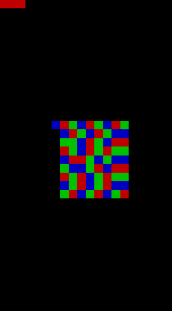

# stegval
 Simple steganography project to hide data inside images.
 Warning, this prototype is not fitted for high volume of data, its purpose is to show how to hide small amount of data.

# Usage

```
 _______________________ _______         _______ _
(  ____ \__   __(  ____ (  ____ \     /(  ___  | \
| (    \/  ) (  | (    \/ (    \/ )   ( | (   ) | (
| (_____   | |  | (__   | |     | |   | | (___) | |
(_____  )  | |  |  __)  | | ____( (   ) )  ___  | |
      ) |  | |  | (     | | \_  )\ \_/ /| (   ) | |
/\____) |  | |  | (____/\ (___) | \   / | )   ( | (____/\ v1.2 by Valenwe
\_______)  )_(  (_______(_______)  \_/  |/     \(_______/

usage: StegaVal [-h] -m {conceal,reveal} -i INPUT [-t {text,file}] [-c {simple,square,random,password}] [-o OUTPUT] [-v] [-vv]

options:
  -h, --help            show this help message and exit
  -m {conceal,reveal}, --mode {conceal,reveal}
                        The mode selected, between hide data in an image, or fetch data from an image.
  -i INPUT, --input INPUT
                        The image to begin the script from.
  -t {text,file}, --type {text,file}
                        [conceal mode] The type of data to hide inside.
  -c {simple,square,random,password}, --conceal_mode {simple,square,random,password}
                        [conceal mode] How the data will be concealed in the image.
  -o OUTPUT, --output OUTPUT
                        The output filename.
  -v, --verbose         Verbosity to display error logs
  -vv, --vverbose       Verbosity for debugging purpose
  ```

# Examples

- `python .\main.py -m conceal -i fig.jpg -t file vic.png` : from file `fig.jpg`, hide the data of the `vic.png` file inside.
- `python .\main.py -m reveal -i output_image.png` : from file `output_image.png`, find the concealed data.
- `python .\main.py -m conceal -i fig.png -t file vic.png -c square` : from file `fig.jpg`, hide the data of the `vic.png` file inside as a square starting from the center.

# How does it work?

The program will use the less significant bit for one of the RGB of each pixel of the image, in this specific order:


1. Conceal mod used (3 bits)
2. (Only for randomly propagated pixels) Seed
3. Data length (32 bits)
4. Data

## Simple
- Conceal mod at the first 3 pixels
- Propagate pixel after pixel on the red value


## Square
- Conceal mod at the first 3 pixels
- Propagate pixel from the center, and around it, and iterate the color id each pixel



## Random or passworded

- Conceal mod at the first 3 pixels
- Seed on the center as a square
- The rest is propagated randomly on the remaining pixels


